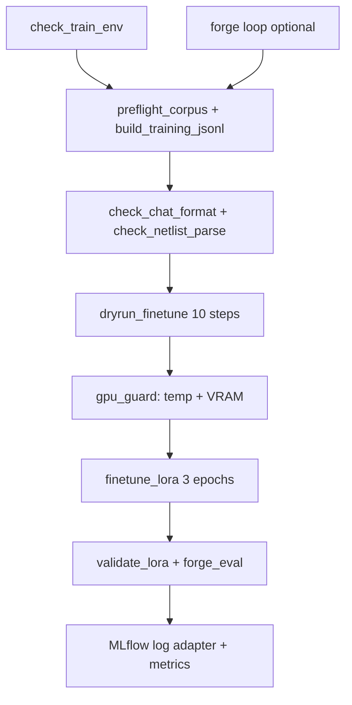

# OpenForge Training DAG — Handoff for Next Cursor/Claude Session

**Machine:** Windows 11, RTX 4070 12.9 GB, WSL2 active  
**Repo:** `C:\Users\user\OpenForge\OpenForge`  
**Venv:** `.venv_train` (Windows GPU training) + `.venv_wsl` (WSL ngspice/forge/CAD)  
**Date:** 2026-06-17

---

## What works today

| Asset | Status |
|-------|--------|
| `data/training/winners.jsonl` | 1028 fitness=1 designs |
| `data/training/finetune.jsonl` | 1002 Qwen chat examples (validated) |
| `data/seeds_normalized.jsonl` | 768+ sim-validated seeds |
| Forge loop | `python -m openanalog forge --n N` — resumable via `data/forge_state.json` |
| ngspice | Ground truth; WSL fallback via `openanalog/config.py` |
| GPU | `torch.cuda.is_available() == True`, RTX 4070 |

## What was broken (fixed this session)

1. **bitsandbytes cuda132** — auto-fallback to `cuda130` in `scripts/train_env.py` (no manual env var needed).
2. **Import order** — on Windows cu132, `import torch` before `datasets` crashes; `train_env` imports datasets first.
3. **Wrong script path** — always from repo root: `python scripts/dryrun_finetune.py`.
4. **Missing train deps** — `pip install -e ".[train]" mlflow` in `.venv_train`.
5. **DATA_PATH** — `finetune_lora.py` now uses `data/training/finetune.jsonl`.

## Efficiency stack (4070 → 32B) — researched 2026-06-17

**Training (P0 — use now):** bitsandbytes NF4 QLoRA + Qwen2.5-Coder-7B on Windows `.venv_train`. Do not switch to MoE/TurboQuant for SFT.

**Inference 7B (P0):** llama.cpp Q4_K_M + merged LoRA (~5 GB). Keep `validate_lora.py` as regression gate.

**Inference 32B on 4070 (P1):** Qwen2.5-Coder-32B Q4_K_M via llama.cpp `-ngl 35-40` (hybrid GPU/CPU, ~18 GB weights). MoE (Qwen3-Coder-30B-A3B) needs ~20 GB all experts — too tight without expert offload.

| Tech | Training 7B | Infer 32B 4070 | Windows | Verdict |
|------|-------------|----------------|---------|---------|
| bitsandbytes NF4 | ✓✓ production | N/A | ✓ | **Keep** |
| llama.cpp GGUF | N/A | ✓ hybrid | ✓ | **Add for eval** |
| vLLM PagedAttention | N/A | batch only | WSL/fork | Phase B benchmark |
| TurboQuant KV | N/A | KV savings ctx>8k | experimental | Watch |
| DeepSeek MLA/MoE | ✗ immature PEFT | tiered infer | WSL | Research only |
| PowerInfer | ✗ wrong arch | sparse only | ✓ | Skip (Qwen=SwiGLU) |
| MaiStorage aiDAPTIV+ | overkill | needs Phison SSD | ✓+HW | Skip for 7B LoRA |
| Qwen3.5-9B | tight 10-12GB | N/A | ✓ | Phase B ablation only |

**OOM upgrades for finetune:** add `optim="paged_adamw_8bit"` if epoch 2–3 OOMs.

**Harness gate target:** >50% fitness=1 on generated netlists post-LoRA. Check: `python scripts/harness_gate_report.py`

**Model compare:** `python scripts/benchmark_models.py --lora openforge-lora-v1 --samples 20`

---


```powershell
cd C:\Users\user\OpenForge\OpenForge
.\.venv_train\Scripts\Activate.ps1
pip install -e ".[train]" mlflow

# Quick launcher
.\scripts\train.ps1 check      # CHECK 0
.\scripts\train.ps1 preflight  # CHECK 1-4
.\scripts\train.ps1 dryrun     # CHECK 3 — 10 GPU steps
.\scripts\train.ps1 finetune   # 3-epoch LoRA
.\scripts\train.ps1 dag        # 48h orchestrated pipeline

# Or manual:
python scripts/check_train_env.py

# CHECK 1–4 — data + format + netlist + LoRA targets
python scripts/validate_finetune_jsonl.py
python scripts/preflight_corpus.py
python scripts/check_chat_format.py
python scripts/check_netlist_parse.py
python scripts/check_lora_targets.py

# CHECK 3 — 10-step GPU dry-run
python scripts/dryrun_finetune.py

# 48h DAG (forge + train + validate, thermal/OOM guards)
python scripts/run_train_dag.py --hours 48

# Or manual 3-epoch LoRA only
python -u scripts/finetune_lora.py
python scripts/validate_lora.py
```

**OOM fallback:** `per_device_train_batch_size=1`, keep `gradient_accumulation_steps=8`.

---

## Architecture — 48h DAG



**State file:** `data/dag_state.json` — resume after crash/thermal pause.  
**MLflow:** `mlruns/` local; set `MLFLOW_TRACKING_URI` for remote.

---

## Phase map (do not skip gates)

### Phase A — Fix & validate (this session)
- [x] `scripts/train_env.py` — bnb DLL fallback, diagnostics
- [x] Harden `finetune_lora.py`, `dryrun_finetune.py`
- [x] `scripts/check_train_env.py`, `scripts/run_train_dag.py`
- [ ] Run dryrun + 3-epoch local test on 4070

### Phase B — Model zoo & benchmark (next session)
Candidates to download and compare (coding + chip-adjacent):

| Model | HF ID | VRAM 4-bit est. | Notes |
|-------|-------|-----------------|-------|
| Qwen2.5-Coder-7B | `Qwen/Qwen2.5-Coder-7B-Instruct` | ~6 GB | **Current production** |
| Qwen3.5-9B | `Qwen/Qwen3.5-9B` | ~8 GB | Newer; test chat template |
| Gemma 3 | `google/gemma-3-4b-it` | ~4 GB | Smaller smoke |
| NVIDIA Nemotron | `nvidia/Nemotron-*` | varies | Check HF nvidia org |
| Phi-4-mini | `microsoft/phi-4-mini-instruct` | ~4 GB | Fast baseline |

**Benchmark harness (to build):** `scripts/benchmark_models.py`
- Fixed prompt set from `finetune.jsonl` holdout
- Metrics: ngspice parse rate, `forge_eval` fitness, token length, latency
- Optional vLLM server for inference (`pip install vllm` — WSL/Linux preferred)

### Phase C — 24/7 automation
- `run_train_dag.py --hours 48 --thermal-max 82 --cooldown 300`
- Subagent mutate loop: on failure → adjust hyperparams → retry (max 3)
- HuggingFace private repos: dataset `winners.jsonl` + `finetune.jsonl`, model adapters

### Phase D — WSL OSS CAD (verification, not training)
Use WSL for Yosys/KLayout — **not installed yet**. Do NOT install CUDA 13.2 in WSL unless needed.

```bash
# WSL only — verification path
source .venv_wsl/bin/activate
sudo apt install -y yosys  # or OpenROAD flow later
python -m openanalog verify <netlist.sp>
```

Training stays in **Windows `.venv_train`** (4070 + bitsandbytes override).

### Phase E — Lottery / physics-guided mutation (research)
- Random topology subgraphs (current mirror, source follower, diff pair) with ngspice fitness gate
- Tag special configs in KG (`openanalog/forge/knowledge_graph.py`)
- Only fitness=1 → `winners.jsonl` (never relax)

### Phase F — Paper extraction pipeline
- Interposer, 3D stacking, TSV — ingest to KG, not direct training
- `openanalog/ingestion/pdf_pipeline.py` + checkpoint resume
- Clone audit repos (AnalogSAGE, GraphGYM) — gitignored, re-clone on 4070 if needed

---

## Files never in GitHub

- `data/training/*.jsonl` — backup to HuggingFace private dataset
- `env.local` / `.env` — secrets
- `openforge-lora-v1/` — LoRA weights → HF private model repo
- `mlruns/` — optional local only

## Files to rsync to new 4070 machine

1. `env.local` (keys, paths)
2. `data/seeds_normalized.jsonl`
3. `data/training/winners.jsonl`
4. `data/training/finetune.jsonl`
5. `data/forge_state.json` (if resuming forge)
6. `data/dag_state.json` (if resuming DAG)

Then: `git clone` repo → `pip install -e ".[train]"` → restore files above.

---

## Success criteria

| Stage | Pass |
|-------|------|
| dryrun | 10 steps complete, loss printed |
| 3-epoch LoRA | loss ~0.8–1.2 by epoch 3 |
| validate_lora | ≥3/4 heuristic checks + ngspice parse |
| DAG 48h | completes or resumes; MLflow run logged |
| vs base model | LoRA beats base on fitness=1 rate |

---

## Known doc drift

- `OPENANALOG_HANDOFF.md` understates forge progress — see `docs/STATUS.md`
- `Makefile` has hardcoded `/mnt/c/Users/oojia/OpenForge` — use your path: `/mnt/c/Users/user/OpenForge`
